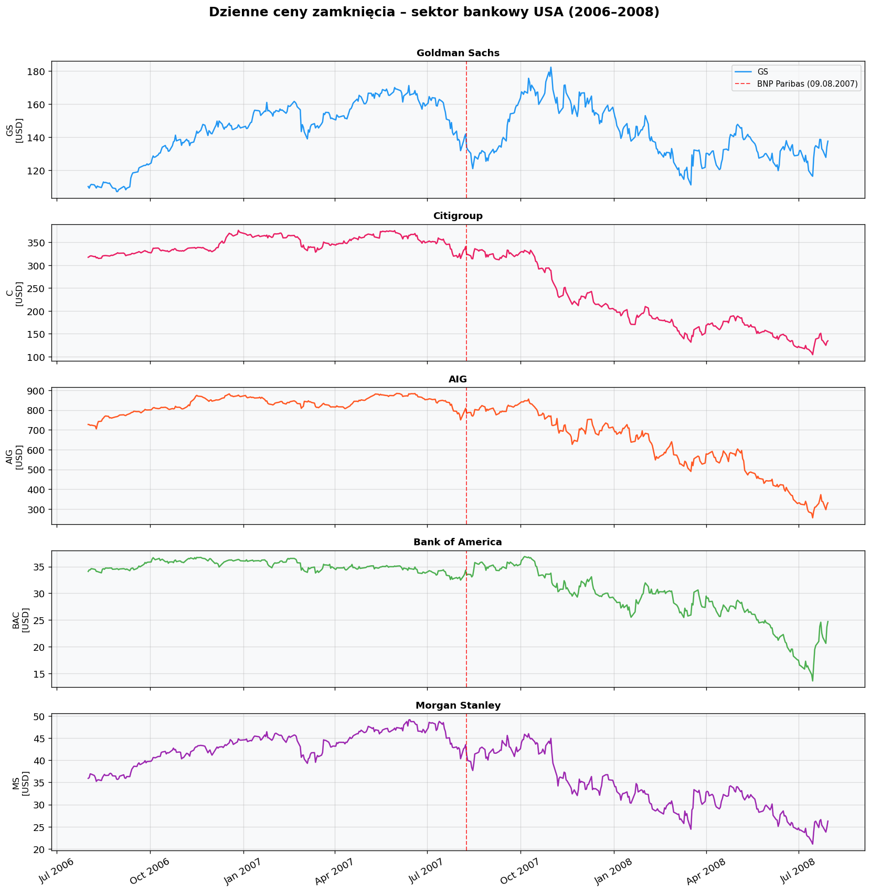
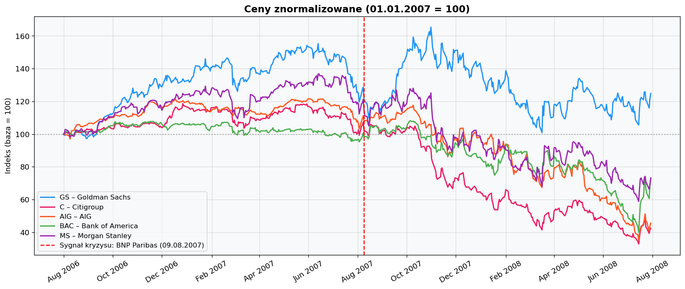
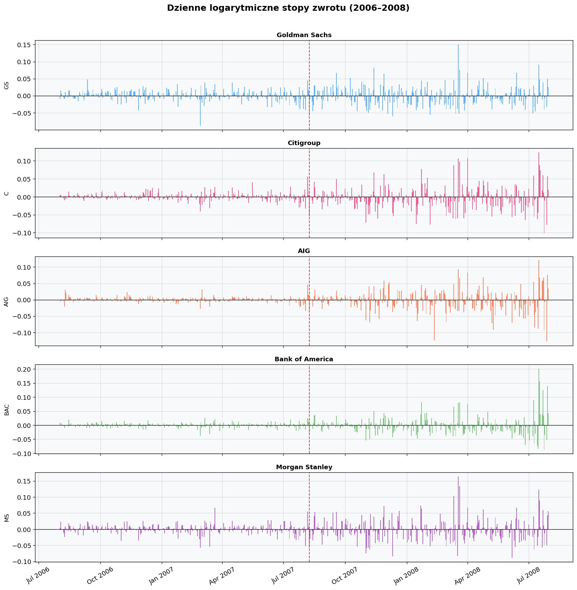
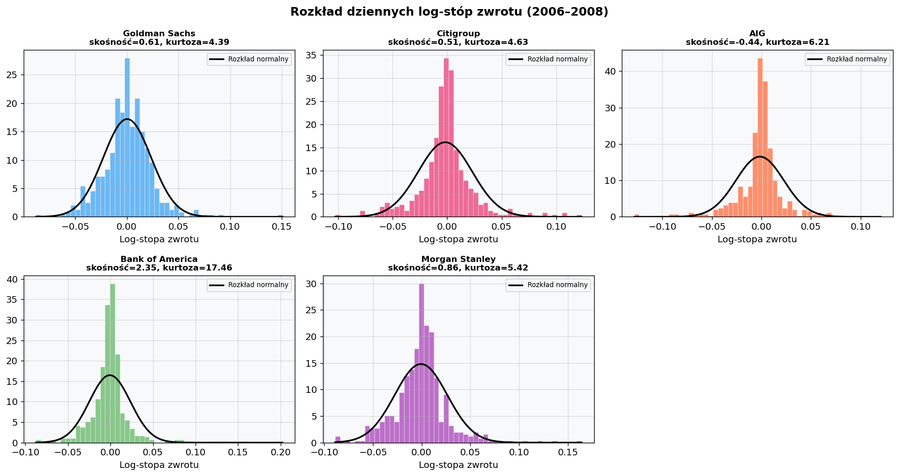
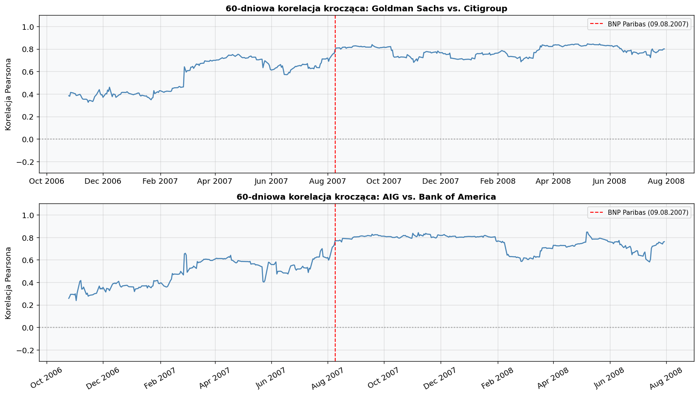
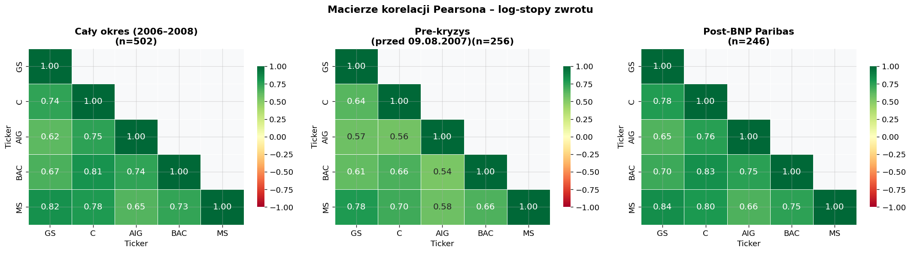

# Raport analityczny: Sektor bankowy USA w kryzysie finansowym 2007–2008

**Autor:** Oleksandra Krykun  
**Data:** 14 kwietnia 2026  
**Kurs:** Market Risk Lab – Zadanie Domowe 1

---

## Kontekst historyczny: Kryzys finansowy 2007–2008

Globalny kryzys finansowy lat 2007–2008 był najpoważniejszym załamaniem rynków od czasu Wielkiego Kryzysu lat 30. XX wieku. U jego podstaw leżała wieloletnia ekspansja rynku kredytów hipotecznych subprime w Stanach Zjednoczonych, wspierana przez niskie stopy procentowe, liberalną politykę kredytową i intensywny rozwój instrumentów sekurytyzacyjnych (MBS, CDO). Banki i ubezpieczyciele masowo przenosili ryzyko kredytowe poza bilanse, co przez lata dawało złudne poczucie bezpieczeństwa.

Pierwsze sygnały załamania pojawiły się wiosną 2007 roku, gdy zaczęły rosnąć wskaźniki niespłacanych kredytów hipotecznych. Za przełomowy moment uznaje się **9 sierpnia 2007 r.**, kiedy bank BNP Paribas zawiesił wypłaty z trzech funduszy inwestycyjnych zarządzających aktywami o łącznej wartości 2,2 mld USD, powołując się na *„complete evaporation of liquidity"* — całkowite wyparowanie płynności na rynku instrumentów opartych na kredytach subprime. Tego samego dnia Europejski Bank Centralny interweniował, wpompowując w rynek 95 mld EUR płynności. Był to sygnał, że banki przestały sobie ufać i odmawiają wzajemnego finansowania. Kilka dni wcześniej, 6 sierpnia 2007 r., jeden z największych kredytodawców hipotecznych — American Home Mortgage — ogłosił upadłość. Indeks DJIA, który osiągnął szczyt w lipcu 2007 r., do 16 sierpnia stracił ok. 8,3%.

Kolejne miesiące przyniosły lawinę dramatycznych zdarzeń: nacjonalizację brytyjskiego banku Northern Rock (luty 2008), uratowanie Bear Stearns przez JPMorgan przy wsparciu Fed (marzec 2008), wreszcie — w kolejnych kwartałach — upadek Lehman Brothers i nacjonalizację AIG. Kryzys przerodził się w recesję globalną.

Niniejsza analiza obejmuje okres **sierpień 2006 – lipiec 2008**, z punktem podziału na fazę pre-kryzys (przed 9 sierpnia 2007) i fazę narastającego kryzysu (po 9 sierpnia 2007), co pozwala uchwycić zmianę dynamiki rynku bezpośrednio po pierwszym systemowym sygnale.

---

## 1. Wybór spółek

Do analizy wybrano pięć instytucji finansowych, które odegrały kluczową rolę w kryzysie 2007–2008:

| Ticker | Spółka | Rola w kryzysie |
|--------|--------|-----------------|
| **GS** | Goldman Sachs | Największy bank inwestycyjny; przetrwał kryzys, ale otrzymał pomoc TARP (10 mld USD) |
| **C** | Citigroup | Największy bank komercyjny w USA; otrzymał wsparcie rządowe ~45 mld USD; akcje straciły ponad 90% |
| **AIG** | American International Group | Ubezpieczyciel masowo wystawiający CDS na MBS; przejęty przez rząd USA we wrześniu 2008 |
| **BAC** | Bank of America | Przejął zagrożony Merrill Lynch w 2008 r.; znaczne straty na portfelu hipotecznym |
| **MS** | Morgan Stanley | Bank inwestycyjny przekształcony w holding bankowy we wrześniu 2008; bliski upadku w szczytowej fazie kryzysu |

### Uzasadnienie wyboru

Wszystkie pięć spółek łączy:

1. **Wspólna ekspozycja na rynek MBS/CDO** — każda miała znaczące pozycje w instrumentach powiązanych z kredytami subprime, co tworzyło wspólny czynnik ryzyka.
2. **Wzajemne powiązania kontrahenckie** — banki inwestycyjne (GS, MS) i AIG łączyły transakcje CDS i repo; problemy jednej instytucji bezpośrednio zagrażały pozostałym.
3. **Efekt zarażania (contagion)** — sygnał BNP Paribas z 9 sierpnia 2007 r. uderzył w cały sektor jednocześnie, co powinno być widoczne we wzroście korelacji i zmienności.
4. **Różne profile ryzyka** — zestawienie ubezpieczyciela (AIG) z bankami inwestycyjnymi (GS, MS) i komercyjnymi (C, BAC) pozwala porównać reakcję różnych modeli biznesowych na ten sam szok systemowy.

**Hipoteza wstępna:** Oczekujemy wysokich dodatnich korelacji między tymi spółkami, szczególnie po sygnale kryzysu z 9 sierpnia 2007 r. (zamrożenie płynności przez BNP Paribas), oraz wyraźnie wyższej zmienności w fazie narastającego kryzysu (Q3 2007 – Q2 2008).

---

## 2. Dane

**Źródło:** Yahoo Finance (`yfinance`), dzienne ceny zamknięcia skorygowane o dywidendy i splity (`Adj Close`).  
**Okres:** 1 sierpnia 2006 – 31 lipca 2008 (2 lata; sierpień 2007 jako środek okresu).  
**Format:** data × cena zamknięcia [USD].  
**Liczba obserwacji:** 503 dni sesyjne × 5 spółek.  

---

## 3. Jakość danych

### 3.1 Brakujące wartości

Żaden z tickerów nie wykazał brakujących obserwacji (0 NaN, 0%). Dane są kompletne.

### 3.2 Spójność dat

W indeksie nie wykryto dni weekendowych ani duplikatów. Zidentyfikowano 13 przerw dłuższych niż 3 dni (wszystkie wynoszące dokładnie 4 dni kalendarzowe), odpowiadających długim weekendom giełdowym NYSE:

| Data od | Data do | Długość | Święto |
|---------|---------|---------|--------|
| 2006-09-01 | 2006-09-05 | 4 dni | Labor Day |
| 2006-12-22 | 2006-12-26 | 4 dni | Boże Narodzenie |
| 2006-12-29 | 2007-01-03 | 5 dni | Nowy Rok |
| 2007-01-12 | 2007-01-16 | 4 dni | MLK Day |
| 2007-02-16 | 2007-02-20 | 4 dni | Presidents' Day |
| 2007-04-05 | 2007-04-09 | 4 dni | Wielkanoc |
| 2007-05-25 | 2007-05-29 | 4 dni | Memorial Day |
| 2007-08-31 | 2007-09-04 | 4 dni | Labor Day |
| 2008-01-18 | 2008-01-22 | 4 dni | MLK Day |
| 2008-02-15 | 2008-02-19 | 4 dni | Presidents' Day |
| 2008-03-20 | 2008-03-24 | 4 dni | Wielkanoc |
| 2008-05-23 | 2008-05-27 | 4 dni | Memorial Day |
| 2008-07-03 | 2008-07-07 | 4 dni | Independence Day |

Wszystkie przerwy są zgodne z oficjalnym kalendarzem NYSE — **dane są spójne**.

### 3.3 Outliery

Kryterium: dzienna log-stopa zwrotu z |z-score| > 4,0. Wykryto łącznie **16 obserwacji**:

| Ticker | Data | Stopa zwrotu | Kontekst |
|--------|------|-------------|---------|
| GS | 2008-03-18 | +15,07% | Reakcja na uratowanie Bear Stearns przez Fed/JPMorgan |
| C | 2008-03-18 | +10,64% | j.w. |
| C | 2008-03-20 | +9,75% | Kontynuacja odbicia po Bear Stearns |
| C | 2008-04-01 | +10,70% | Lepsze od oczekiwań wyniki Q1 2008 |
| C | 2008-07-16 | +12,33% | Odbicie sektora finansowego |
| C | 2008-07-24 | −10,26% | Powrót obaw o kondycję banków |
| AIG | 2008-02-11 | −12,47% | Ujawnienie strat na portfelu CDS |
| AIG | 2008-07-16 | +12,04% | Odbicie sektora finansowego |
| AIG | 2008-07-28 | −12,83% | Powrót presji sprzedażowej |
| BAC | 2008-07-16 | +20,22% | Najsilniejsza jednodniowa zwyżka w sektorze |
| BAC | 2008-07-17 | +15,61% | Kontynuacja odbicia |
| BAC | 2008-07-22 | +12,46% | Nadal wysoka zmienność |
| BAC | 2008-07-29 | +13,82% | Kolejny silny ruch |
| MS | 2008-03-18 | +16,39% | Bear Stearns – ulga w sektorze |
| MS | 2008-03-20 | +13,38% | Kontynuacja odbicia |
| MS | 2008-07-16 | +12,28% | Odbicie sektora finansowego |

**Decyzja: outliery nie są usuwane.** Ekstremalnie duże ruchy są odzwierciedleniem realnych, udokumentowanych zdarzeń rynkowych — ich usunięcie zniekształciłoby obraz ryzyka, który jest właśnie przedmiotem analizy.

### 3.4 Ceny ujemne i zerowe

Żadna z 2515 obserwacji cenowych nie była ujemna ani zerowa. Dane są prawidłowe.

### Podsumowanie jakości danych

| Kryterium | Status | Działanie |
|-----------|--------|-----------|
| Brakujące dane (NaN) | Brak | — |
| Weekendy / duplikaty | Brak | — |
| Luki w szeregu | Tylko przerwy świąteczne NYSE | — |
| Ceny ujemne / zerowe | Brak | — |
| Outliery (\|z\|>4) | 16 obs. | Zachowane — reprezentują realne zdarzenia kryzysowe |

---

## 4. Stopy zwrotu

### 4.1 Metodologia

Dzienne logarytmiczne stopy zwrotu obliczono jako:

$$r_t = \ln\left(\frac{P_t}{P_{t-1}}\right)$$

Logarytmiczne stopy zwrotu są addytywne w czasie, co jest kluczową własnością przy analizie wielookresowej. Mają też lepsze właściwości statystyczne niż stopy arytmetyczne i są standardem w modelowaniu ryzyka rynkowego (VaR, GARCH).

### 4.2 Wykresy cen

Na wykresach znormalizowanych wyraźnie widać rozbieżność trajektorii po sierpniu 2007:
- **Goldman Sachs** przez większość okresu utrzymuje wartość powyżej bazy — jest relatywnie odporny.
- **Citigroup, AIG** i **Bank of America** wykazują wyraźny, trwały trend spadkowy od Q3 2007.
- **Morgan Stanley** zachowuje się podobnie do GS, ale z wyższą zmiennością.

### 4.3 Statystyki opisowe

| Spółka | N | Śr. dzienna | Std dzienna | Min | Max | Skośność | Kurtoza | Śr. roczna | Vol roczna | Sharpe\* |
|--------|---|-------------|-------------|-----|-----|----------|---------|------------|------------|---------|
| Goldman Sachs | 502 | +0,044% | 2,319% | −8,786% | +15,074% | 0,61 | 4,39 | +11,13% | 36,82% | 0,30 |
| Citigroup | 502 | −0,171% | 2,473% | −10,263% | +12,326% | 0,51 | 4,63 | −43,11% | 39,26% | −1,10 |
| AIG | 502 | −0,157% | 2,413% | −12,830% | +12,036% | −0,44 | 6,21 | −39,51% | 38,31% | −1,03 |
| Bank of America | 502 | −0,064% | 2,422% | −8,745% | +20,219% | 2,35 | 17,46 | −16,12% | 38,45% | −0,42 |
| Morgan Stanley | 502 | −0,062% | 2,693% | −8,858% | +16,392% | 0,86 | 5,42 | −15,68% | 42,75% | −0,37 |

*\* Sharpe uproszczony bez stopy wolnej od ryzyka, jedynie jako miara stosunku zwrotu do ryzyka.*

### 4.4 Wykresy stóp zwrotu

### 4.5 Histogramy rozkładu

### 4.6 Zmienność krocząca (30-dniowa)

### 4.7 Komentarz do wyników

**Zwroty roczne.** Jedynie Goldman Sachs w analizowanym okresie wykazuje dodatnią annualizowaną stopę zwrotu (+11,1%). Pozostałe spółki odnotowały straty, przy czym największe poniosły Citigroup (−43,1%) i AIG (−39,5%) — czyli instytucje najbardziej bezpośrednio zaangażowane w produkty sekurytyzacyjne i CDS.

**Zmienność.** Wszystkie spółki charakteryzują się wysoką roczną zmiennością (37–43%), znacznie przekraczającą typowe poziomy sprzed kryzysu (~15–20%). Morgan Stanley wykazuje najwyższą zmienność (42,7%), co odzwierciedla jego silną ekspozycję na działalność tradingową.

**Rozkład stóp zwrotu — odchylenia od normalności:**

- **Kurtoza > 3 (grube ogony):** wszystkie spółki, najsilniej Bank of America (kurtoza = 17,5) i AIG (6,2). Oznacza to, że ekstremalnie duże ruchy zdarzają się znacznie częściej, niż przewiduje rozkład normalny — model VaR oparty na założeniu Gaussowskim będzie **systematycznie niedoszacowywał ryzyko**.

- **Skośność:** Bank of America wykazuje silną dodatnią skośność (2,35) ze względu na klaster outlierów w lipcu 2008 (kilka kolejnych sesji z +12–20%). AIG jako jedyna spółka ma ujemną skośność (−0,44), co sugeruje, że duże jednodniowe straty były bardziej prawdopodobne niż duże zyski.

**Skupianie zmienności (volatility clustering).** Na wykresach stóp zwrotu wyraźnie widoczna jest tendencja do grupowania dużych wahań — po sierpniu 2007 okresy wysokiej zmienności następują po sobie, nie są rozproszone losowo. Jest to cecha typowa dla rynków finansowych opisywana przez modele ARCH/GARCH.

**Wzrost zmienności po sierpniu 2007.** 30-dniowa zmienność krocząca wyraźnie rośnie od sygnału BNP Paribas. W fazie spokojnej (2006 – sierpień 2007) oscylowała w okolicach 15–25% rocznie; w fazie kryzysu (Q4 2007 – Q2 2008) regularnie przekraczała 40–50%, a dla AIG osiągała chwilowo ponad 60%.

---

## 5. Korelacje

### 5.1 Macierze korelacji Pearsona

**Cały okres (2006–2008):**

| | GS | C | AIG | BAC | MS |
|--|-----|-----|-----|-----|-----|
| **GS** | 1,000 | 0,742 | 0,619 | 0,670 | 0,825 |
| **C** | 0,742 | 1,000 | 0,746 | 0,814 | 0,782 |
| **AIG** | 0,619 | 0,746 | 1,000 | 0,738 | 0,647 |
| **BAC** | 0,670 | 0,814 | 0,738 | 1,000 | 0,733 |
| **MS** | 0,825 | 0,782 | 0,647 | 0,733 | 1,000 |

**Pre-kryzys (przed 09.08.2007):**

| | GS | C | AIG | BAC | MS |
|--|-----|-----|-----|-----|-----|
| **GS** | 1,000 | 0,637 | 0,574 | 0,608 | 0,782 |
| **C** | 0,637 | 1,000 | 0,556 | 0,664 | 0,698 |
| **AIG** | 0,574 | 0,556 | 1,000 | 0,538 | 0,576 |
| **BAC** | 0,608 | 0,664 | 0,538 | 1,000 | 0,658 |
| **MS** | 0,782 | 0,698 | 0,576 | 0,658 | 1,000 |

**Zmiana korelacji (post − pre):**

| | GS | C | AIG | BAC | MS |
|--|-----|-----|-----|-----|-----|
| **GS** | — | **+0,141** | +0,077 | +0,097 | +0,059 |
| **C** | +0,141 | — | **+0,206** | **+0,166** | +0,098 |
| **AIG** | +0,077 | +0,206 | — | **+0,213** | +0,086 |
| **BAC** | +0,097 | +0,166 | +0,213 | — | +0,092 |
| **MS** | +0,059 | +0,098 | +0,086 | +0,092 | — |

### 5.2 Korelacja krocząca

### 5.3 Ocena wyników

**Potwierdzenie hipotezy.** Wszystkie pary spółek wykazują **wysoką, dodatnią korelację** — zgodnie z hipotezą wstępną. Sektor finansowy porusza się wspólnie pod wpływem tych samych czynników makro (stopy procentowe, warunki płynności, sentyment wobec ryzyka kredytowego).

**Wzrost korelacji po sierpniu 2007.** Każda bez wyjątku para spółek wykazuje wyższe korelacje po sygnale BNP Paribas niż przed nim. Wzrosty wahają się od +0,059 (GS–MS) do +0,213 (AIG–BAC i C–AIG). Najsilniej wzrosły korelacje z udziałem AIG i Citigroup — co ma sens, bo to te dwie instytucje były najbardziej narażone na utratę zaufania rynku.

**Implikacje dla zarządzania ryzykiem.** Obserwowane zjawisko jest klasycznym przykładem *correlation breakdown* (zwanego też błędnie *correlation breakdown* — korelacje nie załamują się, lecz rosną dokładnie wtedy, gdy liczymy na dywersyfikację):

- Portfel złożony z tych akcji traci dywersyfikację w momencie kryzysu.
- Modele VaR zbudowane na korelacjach z okresu spokojnego dramatycznie niedoszacowują straty ogonowe.
- Korelacje nie są stałe w czasie — wykres korelacji kroczącej potwierdza ich silną zmienność i wyraźny skok po sierpniu 2007.

**Najsilniej skorelowana para:** Morgan Stanley – Goldman Sachs (0,825 dla całego okresu), co wynika z identycznego modelu biznesowego (bankowość inwestycyjna, duże biura tradingowe).

**Najsłabiej skorelowana para:** AIG – Goldman Sachs (0,619), co odzwierciedla fundamentalną różnicę profilu ryzyka: ubezpieczyciel sprzedający ochronę kredytową vs. bank inwestycyjny aktywnie zarządzający pozycjami.

---

## 6. Podsumowanie

Niniejsza analiza zebrała i przygotowała dane rynkowe dla pięciu instytucji finansowych stanowiących jądro kryzysu 2007–2008. Kluczowe wnioski:

| Obszar | Wniosek |
|--------|---------|
| **Jakość danych** | Wysoka — brak NaN, duplikatów, cen ujemnych. 16 outlierów zachowanych jako realne zdarzenia kryzysowe |
| **Rozkład stóp zwrotu** | Wyraźnie nieGaussowski — grube ogony (kurtoza >> 3), asymetria. Konieczne modele nieparametryczne lub t-Studenta przy obliczaniu VaR |
| **Zmienność** | Gwałtowny wzrost od sierpnia 2007; volatility clustering przemawia za modelami GARCH |
| **Korelacje** | Wysokie i dodatnie w całym okresie; wzrost o 0,06–0,21 po sygnale kryzysu — klasyczny efekt zarażania (contagion) |
| **Jedyny „wygrany"** | Goldman Sachs — jedyna spółka z dodatnim zwrotem (+11,1% rocznie); pozostałe straciły 16–43% |

Dane są przygotowane do kolejnego etapu — obliczania miar ryzyka (Value at Risk, Expected Shortfall).

---

*Źródła danych: Yahoo Finance. Teoria: Market Risk Lab – prezentacja „Dane rynkowe" (kwiecień 2026). Kontekst historyczny: Wikipedia, „Financial crisis of 2007–2008".*
